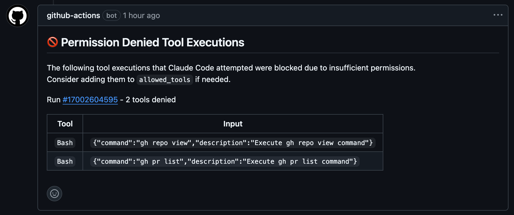

# Claude Denied Tools Action

[](https://github.com/koki-develop/claude-denied-tools/releases/latest)
[](https://github.com/koki-develop/claude-denied-tools/actions/workflows/ci.yml)
[](https://github.com/koki-develop/claude-denied-tools/actions/workflows/build.yml)

Report a list of tools that were denied due to insufficient permissions when used by Claude Code Action.



## Usage

This action analyzes Claude Code Action execution logs to identify tools that were denied due to insufficient permissions.  
It automatically posts a detailed report to your PR or Issue, helping you understand which tool permissions need to be configured.

```yaml
- uses: anthropics/claude-code-action@beta
  id: claude
  with:
    # ... your Claude Code Action configuration
- uses: koki-develop/claude-denied-tools@v1
  with:
    # Pass the execution file from the Claude Code Action
    claude-code-execution-file: ${{ steps.claude.outputs.execution_file }}
```

## Inputs

| Name | Description | Required | Default |
| --- | --- | --- | --- |
| `claude-code-execution-file` | The `outputs.execution_file` from anthropics/claude-code-action | **Yes** | - |
| `github-token` | GitHub token for API access | No | `${{ github.token }}` |
| `sticky-comment` | If `true`, updates existing comment instead of creating new ones for each run | No | `false` |
| `skip-comment` | If `true`, skip creating/updating PR/Issue comments | No | `false` |

## Outputs

| Name | Description |
| --- | --- |
| `report` | Markdown-formatted report of denied tool executions |
| `denied-tools` | List of denied tools (JSON format) |

## License

[MIT](./LICENSE)
